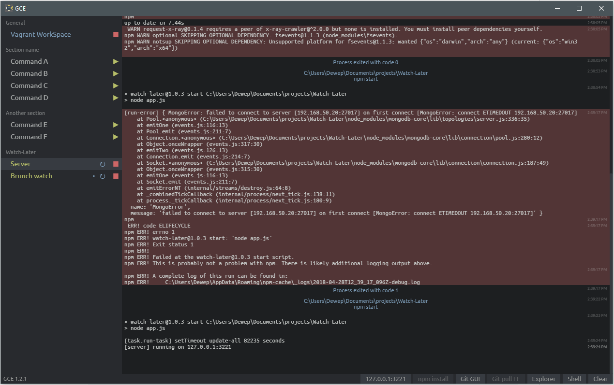

# GCE

## Global Commands Execution

Desktop application to run regular scripts (webpack dev, server, vagrant, etc.). [Download the latest release.](https://github.com/Dewep/GCE/releases/latest)



The list of commands must be in your "home" folder (`C:/Users/XXXX/` or `/home/XXXX/`), in a configuration file named `gce.yml`.

## Configuration file

```yml
---
# GCE https://github.com/Dewep/GCE

root: C:\Users\Dewep\Documents\projects

shell: [C:\Program Files\Git\git-bash.exe, --cd=%dir%]

extra:
  git:
    name: Git pull FF
    cmd: git pull --ff-only
  npm:
    name: Npm install
    cmd: npm install

default-extra: [git, npm]

commands:
  - name: Vagrant WorkSpace
    cmd: vagrant up
    stop-cmd: vagrant halt
    extra: []

  - name: Watch-Later/Server
    path: Watch-Later
    cmd: npm start
  - name: Watch-Later/Brunch watch
    path: Watch-Later
    cmd: npm run watch-app
```

__commands[]__:

- `name`: Name of the command. Possibility to group the command in sections, by adding the section name followed by a `/` before the name (`Section name/Command name`).
- `path` _(optional)_: Directory path to run the command. This is append to the `root` configuration path.
- `cmd`: Command to exec.
- `stop-cmd` _(optional)_: If defined, allows to have a command to execute when stopping the service. This is useful for commands such as Vagrant: `cmd` is used to start the VM (`vagrant up`), `stop-cmd` to stop it (`vagrant halt`).
- `extra` _(optional, default to `default-extra`)_: Array of extra commands (present in the status-bar).

__extra[]__:

- `name`: Name of the extra command.
- `cmd`: Command to exec.

__shell[]__:

- Arguments to spawn a new shell (`Open shell` in the status-bar). `%dir%` is replaced with the directory path of the "command".

## Credits

Colors (Tomorrow night): https://github.com/chriskempson/tomorrow-theme#tomorrow-night

Font family (Ubuntu font): https://design.ubuntu.com/font/

## TODO

- Better GIT integration (see+switch branch, parallel calls)
- Remove replay if sub-cmd
